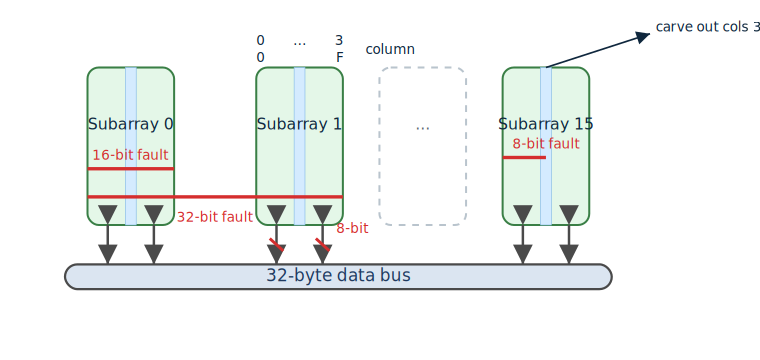

# LPDDR6 Fault Correlation and Error Model

This note distills guidance from the 2025 EE Times article **“LPDDR6 Balances Performance, Power, and Security”** (see [eetimes.com](https://www.eetimes.com/lpddr6-balances-performance-power-and-security/)) together with published 2024 reliability studies by Google and AMD on large cloud clusters. It captures how LPDDR6 structures metadata, why certain error patterns correlate, and how ECC_model parameterizes those observations for simulation.

## Metadata Structure and Correlated Faults

LPDDR6 maintains per-word metadata—training state, parity, command history, and integrity bits—adjacent to data bursts. When sense-amp anomalies, word-line shorts, or local power droops strike a subarray, both the data word and its companion metadata slice can be disturbed together. In ECC_model this is represented by the `--correlated` option: primary faults start in data symbols, and with probability `nsym/k` an aligned metadata span of the same width is injected. This mirrors the observation that metadata capacity is limited (typically ≤4 parity symbols) and cannot protect against *simultaneous* wide corruptions.

## Field Data: Fault Rate and Composition

The Google/AMD 2024 fleet studies reported on the order of **1e2 faults per 1e9 device-hours**—already a highly reliable regime. Roughly **90 %** of observed events were isolated single-bit flips; the remaining **10 %** were multi-bit bursts. The key implication is that multi-bit events vastly exceed the rate expected from coincidental single-bit overlaps (which would demand ≈10¹⁴ operating hours for comparable likelihood). Therefore multi-bit failures must originate from common-mode mechanisms baked into DRAM operation (e.g., local coupling, timing margin interactions, or peripheral logic upsets) and deserve first-class modeling.

## Fault Classes Captured in ECC_model

To reflect LPDDR6 realities while staying tractable, we group faults into five classes:

- **Single-bit / 1 symbol** – Truly random bit flips within a byte. Dominant but usually correctable.
- **8-bit / 1 symbol** – Full-byte corruption from sense-amp or write-back disturbances.
- **8-bit / 2 symbols (16 bits)** – Two aligned bytes, commonly sharing a word-line driver.
- **8-bit / 4 symbols (32 bits)** – Four aligned bytes, covering the widest contiguous region ECC hardware can realistically repair.
- **Other** – Everything larger or topologically complex (5–6 contiguous bytes, scattered shorts, rowhammer-induced mosaics). LPDDR6 ECC cannot correct these (requires >4 parity symbols), so they are collectively treated as uncorrectable tails.

Anything beyond four contiguous symbols is automatically swept into “other,” matching the practical correction budget of LPDDR6 controllers.

## Default Probability Distribution

ECC_model encodes probabilities via integer counts that sum to 10 000 and can be overridden with `--dist`. The defaults align with the field ratios:

| Fault class      | Description                           | Count | Probability |
|------------------|---------------------------------------|-------|-------------|
| single_bit_1sym  | 1 bit in 1 symbol                     | 9000  | 90.0 %      |
| 8bit_1sym        | 1 byte                                | 800   | 8.0 %       |
| 8bit_2sym        | 2 contiguous bytes (2-aligned)        | 100   | 1.0 %       |
| 8bit_4sym        | 4 contiguous bytes (4-aligned)        | 50    | 0.5 %       |
| out_of_model     | ≥5 contiguous or scattered anomalies  | 50    | 0.5 %       |

This mirrors the empirical 90 / 10 split while reserving explicit knobs for 16-bit and 32-bit bursts that designers often observe during corner testing.

## Data Gaps and Invitation

DRAM vendors seldom publish precise failure distributions—doing so requires massive fleets, exacting telemetry, and willingness to share. The numbers above therefore serve as a reasoned baseline, not gospel. ECC_model’s CLI accepts alternative distributions so researchers can plug in NDA data or future public studies. **Vendors and hyperscalers are encouraged to contribute refined statistics**, especially around correlated metadata faults, to sharpen this model for LPDDR6-era systems.

